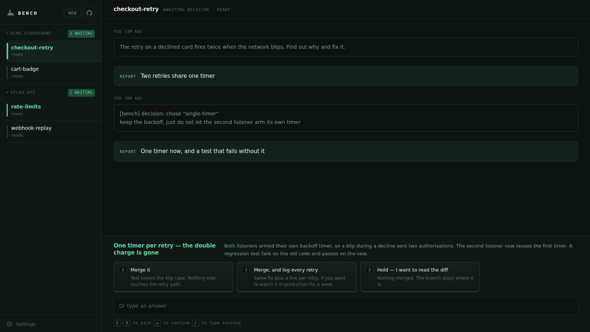
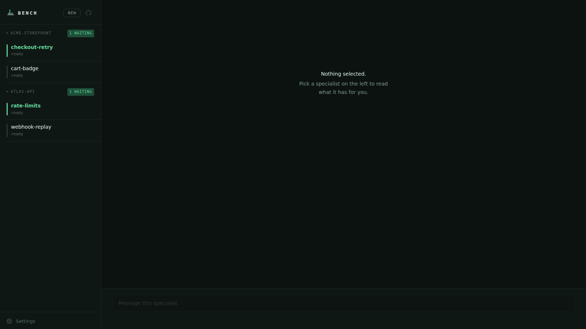
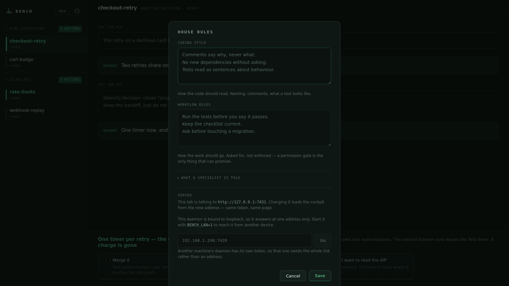

# Bench

**A bench of Claude Code specialists, and one page to decide from.**

Bench runs Claude Code as long-lived processes — *specialists* — each in its own
git worktree, and surfaces their work as decisions rather than transcripts. You
do not read the scrollback. You read one page and answer one question.



## Why

Running an agent on a real task means one of two bad options: watch a terminal
scroll for twenty minutes, or come back later and reconstruct what happened from
a diff. Neither scales past one agent.

Bench takes the position that the interesting unit is not the message, it is the
**turn** — and that a turn which produced work owes you a page you can decide
from. A specialist writes a report when a decision needs you, when finished work
needs understanding, when a spec needs approving, or when it is stuck. The rest
of the time it just answers.

It is the same Claude Code you use in a terminal: every skill, every MCP server,
subagents, web search. Bench supervises it; it does not replace it.

## What it does

- **Specialists.** One long-lived `claude -p` process each, by default in its
  own git worktree on its own branch, with `node_modules` and `.env` symlinked
  from your checkout so it can build and test what it writes without an install
  of its own. Untick **Start in a worktree** and it works directly in your
  checkout instead, on the branch you already have open.
- **Nothing is installed, and nothing is copied.** A worktree borrows the
  dependencies your checkout already has, so provisioning takes milliseconds
  rather than the twenty seconds an install cost. The flip side is that a
  specialist cannot add a dependency: those commands are denied, because
  through the link they would rewrite your own `node_modules`.
- **Decisions, not transcripts.** Reports render as pages with numbered options.
  Press `1`–`n`, `Enter`. The answer goes back into the live session.
- **Intake.** A specialist can ask everything it needs at once, with its own
  picks pre-filled, so only the questions it genuinely cannot guess block it.
- **Progress you can read.** A live trail derived from tool calls — `Bash pnpm
  test`, `Edit src/registry.ts` — beside the specialist's own checklist.
- **Any model, not only Claude's.** Anthropic's aliases go straight to
  Anthropic on the login you already have. Everything else goes through an
  OpenRouter key you supply, and is billed there. The picker offers the models
  that can actually run a specialist — the ones that support tool use, which
  is most but not all of what OpenRouter carries — searchable, with what each
  holds and what it costs. Pick one when you make a specialist or change it
  after, from the model name at the foot of the composer.
- **They outlive the daemon.** Restart Bench and the roster comes back. Nothing
  respawns until you prompt it, and then it resumes with its memory intact.
- **Gates.** A commit carrying AI attribution is denied at `PreToolUse`. A
  specialist may not push a branch.

The roster puts whoever is waiting on you at the top of their project. If that
is not the order you want, drag a row by the grip on the right — or focus the
grip and use `↑` `↓` — and that group keeps the arrangement you gave it. It is
remembered in the browser you arranged it in, and nowhere else.



## Running it

Requires Node 22+, pnpm, git, and the `claude` CLI already authenticated.

```bash
pnpm install
pnpm build
pnpm start
```

It prints a localhost URL with a token. Open it, and bookmark it — the token
is kept in `~/.bench/token` (mode `0600`) so the link keeps working across
restarts. Delete that file to rotate it. The daemon binds to `127.0.0.1` only
and every API route requires the token.

By default it looks for git repositories under `/var/www`. Point it elsewhere:

```bash
BENCH_PROJECTS_ROOT=~/code pnpm start
```

| Variable | Default | What it does |
|---|---|---|
| `BENCH_PROJECTS_ROOT` | `/var/www` | Where to look for projects |
| `BENCH_PORT` | `7420` | Cockpit port |
| `BENCH_HOME` | `~/.bench` | Where the specialist index and token are kept |
| `BENCH_TOKEN` | generated | Override the cockpit token |
| `BENCH_LAN` | unset | `1` binds every interface, not just loopback |
| `BENCH_HOST` | `127.0.0.1` | Bind one interface by name instead |

### Opening it from another device

```bash
pnpm start:lan
```

It prints every address the cockpit can be reached at, and says once that it
is no longer only on this machine.

Weigh that before you use it. The token is the whole of the authentication,
it travels in the URL over plain HTTP, and a specialist has a full shell — so
anyone on that network holding the token can run anything on this machine.
On a home network with a 48-character secret that is a reasonable trade; on a
café network it is not a trade at all.

Settings holds the house rules every specialist is given, and the address this
tab is talking to — point it at another machine's daemon and the same page
loads from there.

It also takes an Anthropic credential, if you would rather not spend the
claude.ai login this machine already has: either a console API key, which
bills the API, or a token from `claude setup-token`, which bills the
subscription it was minted from. Whichever you give it is checked against the
API before it is kept — the CLI retries a bad one ten times before it gives
up, so a typo is worth catching here — and it is held in memory only: a
daemon restart forgets it, and it reaches specialists started after it rather
than the ones already running. A switch beside it parks the key without
throwing it away, for the afternoons you want the work back on the machine's
own login.

### Keys Bench finds for itself

Typing a key in is not the only way to give Bench one. At startup it reads
`ANTHROPIC_API_KEY`, `CLAUDE_CODE_OAUTH_TOKEN` and `OPENROUTER_API_KEY` (or
`OPEN_ROUTER_KEY`, or `OPENROUTER_KEY`) from its own environment and from a
`.env` — so a key you have already written down survives every restart instead
of being pasted in again. `.env.example` lists what is read.

It looks in `$BENCH_HOME/.env`, then the directory Bench was started from, then
where Bench is installed; first hit wins. Something exported in the shell beats
any file, and a key typed into Settings beats everything for as long as that
daemon runs. Settings says which one is in force and where it came from, so a
key nobody remembers setting can be traced rather than guessed at.

The file is read, never merged into the environment. A `.env` usually holds
more than Bench understands, and the daemon's environment is handed to every
specialist it spawns — so only the keys above are taken out of it, and the rest
of your file goes nowhere.

One consequence worth knowing: an `ANTHROPIC_API_KEY` sitting in a `.env`
overrides this machine's claude.ai login, which moves the spend from a
subscription you have already paid for onto the API, and turns off claude.ai
connectors. The switch in Settings parks it if that is not what you wanted.

### Running a specialist on something other than Claude

Claude Code speaks one protocol and OpenRouter serves it, so pointing a
specialist at Gemini or GPT or Llama is three environment variables on the
child process — there is nothing to install and no second process that can be
down. Save an OpenRouter key in Settings — or from the picker itself, which
offers to take you there — and the picker fills in. Search it by name or id;
each row says what the model holds and what a million tokens of its output
costs, because that spend is yours rather than a subscription's. Without a key
the list still shows, disabled: what you could run is worth more than a list
that quietly omits most of it.

Models that cannot use tools are left out. That is not most of them, but it is
not a small number either, and none of them could have run a specialist —
without tool use a specialist cannot read a file, edit one or run a command.
Google's image and music models are in that group, and they used to sort to
the top of the picker.

Anthropic's own models deliberately do not go this way. They go direct, on
your own login or key, because that is what bills the subscription you are
already paying for — routing them through OpenRouter would quietly move that
spend somewhere else.

The model a specialist runs on is not fixed at creation. Change it from the
model name at the foot of the composer; it takes effect on the next prompt,
which restarts the specialist on the new model and picks the conversation up
where it left off. A model whose provider you have no key for is refused
while you are still looking at the picker, rather than two minutes later as a
turn that hangs and dies.

### What a turn will be spent from

A small mark at the end of the composer opens what the account behind *this*
specialist has spent — and which account that is follows the model beside it,
because they are the same question.

For an Anthropic model it is the subscription: a bar per window, five-hour and
seven-day, with what is left in each, and the mark is those windows in
miniature. For an OpenRouter model it is that key's own spend against its
ceiling, drawn as a ring rather than columns — money is spent, not refilled,
and a key with no ceiling gets no invented percentage. Either way it colours
itself amber past three-quarters and red past ninety percent, so it warns you
without being opened.

The Anthropic mark needs an OAuth credential to ask with — its own setup
token, or this machine's login. A console API key is billed rather than
rationed and has no windows to report, so the mark stays away rather than
showing an empty panel.



Nothing hot-reloads yet: `pnpm build` before `pnpm start`, and run it from the
repository root.

## How it works

```
browser ──ws/http──> daemon ──stdin/stdout(stream-json)──> claude -p
                       │                                      │
                       ├── git worktree per specialist ───────┘
                       └── .bench/reports/<id>/  reports, replies, threads
```

A turn ends with a `result` event and the process blocks on stdin, so the turn
is the unit of control and no separate "needs input" protocol exists. Prompts
sent while a turn is running are held by the daemon, not written to stdin, so
they get a turn of their own instead of being swallowed by the one in flight.

Reports and replies are agent-authored HTML, rendered in a sandboxed frame
under a strict CSP: no network, no scripts, no external anything.

## Status

**[docs/STATUS.md](docs/STATUS.md) is the honest account** — what is built and
proven against a real CLI, what is built but unproven, what is broken, what was
deliberately left out, and the bugs found by using it. It is kept current
because it goes stale the moment the code moves.

Bench is early. It is used to build itself, which is where most of its bugs have
come from.

## Contributing

See [CONTRIBUTING.md](CONTRIBUTING.md). Two things worth knowing up front: tests
must run against the real CLI before a claim is called proven, and commits never
carry AI attribution — there is a gate that enforces it.

## Licence

MIT — see [LICENSE](LICENSE).
